# Liftorium Architecture

## Purpose

This document describes how Liftorium is structured, how data moves through the system, and which contracts each subsystem must uphold. It is the primary architecture reference for future implementation and must be read with:

- `docs/product.md`
- `docs/decisions.md`
- `docs/testing-strategy.md`

Liftorium MVP is local-first. There is no runtime cloud backend, account service, or sync service in MVP. The Android app is the primary product surface and owns offline workout execution. The developer-time import workflow produces app-ready program resources. The Web app is a secondary online-only read-only surface.

## Architectural principles

1. **Local-first workout execution**: active workouts must not depend on network access.
2. **Room is the Android source of truth**: active workout state, logs, substitutions, training maxes, and history are persisted in SQLite through Room.
3. **Immutable program versions**: starting a run pins one program version. Historical data never changes because a program is re-imported or edited.
4. **Contract-first program resources**: app runtime consumes validated versioned JSON resources only.
5. **No silent import guessing**: ambiguous or unsupported program constructs block activation unless explicitly classified as note-only.
6. **Read-only Web MVP**: Web cannot mutate workout, program-run, substitution, timer, or training-max state.
7. **Verifiable implementation**: each module must have unit, integration, migration, or runtime tests tied to acceptance scenarios.

## System context

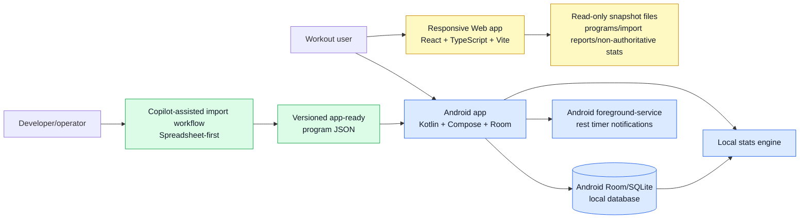

### Runtime boundary

MVP runtime includes:

- Android app.
- Android local database.
- Android foreground-service/notification timer behavior.
- Read-only Web app.

MVP runtime excludes:

- Azure account service.
- Cloud sync.
- User-facing import.
- PDF-assisted import.
- Web workout logging.

### Web data-source boundary

Because MVP has no account service, cloud sync, or user-facing export, Web cannot read live Android user data. Web MVP is read-only against explicit snapshot inputs:

- Versioned program JSON resources.
- Import validation reports.
- Non-authoritative fixture or operator-provided history/stat snapshots used for review.

Web MVP does not promise continuity with the user's Android local history. Real user history on Web requires a future sync or export/restore decision. Until then, Web is useful for program inspection, import review, and read-only rendering of supplied snapshots.

Snapshot rules:

- Snapshot files are versioned and schema-validated.
- Snapshot data is read-only in Web.
- Snapshot freshness is explicit: Web displays when the snapshot was produced.
- Snapshot ingestion is not a user-facing workout-history export feature.
- Web must not write back to Android, Room, or source program resources.

### Developer-time boundary

The import workflow is developer/operator-facing. The developer running the import-workflow skill in a Copilot session IS the cloud-assisted processor; no separate consent prompt is shown. It outputs app-ready resources and reports; it is not part of workout runtime.

## Planned repository layout

```text
Liftorium/
  .github/
    copilot-instructions.md
    skills/
  android/
    app/
    core/
    data/
    domain/
    feature-*/
  web/
    src/
  schema/
    program-resource.schema.json
    examples/
    fixtures/
  tools/
    import/
  docs/
    architecture.md
    product.md
    decisions.md
    mvp-roadmap.md
    testing-strategy.md
    workstreams/
```

The exact package/module names can change during project setup, but the dependency direction must not:

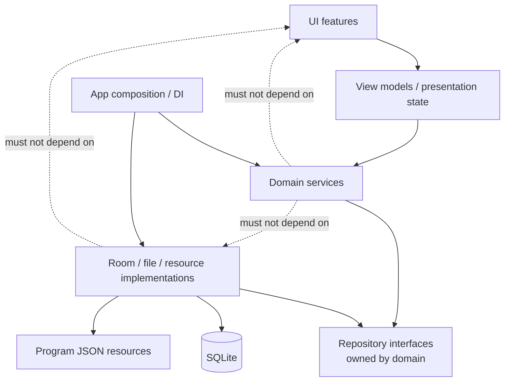

## Container architecture

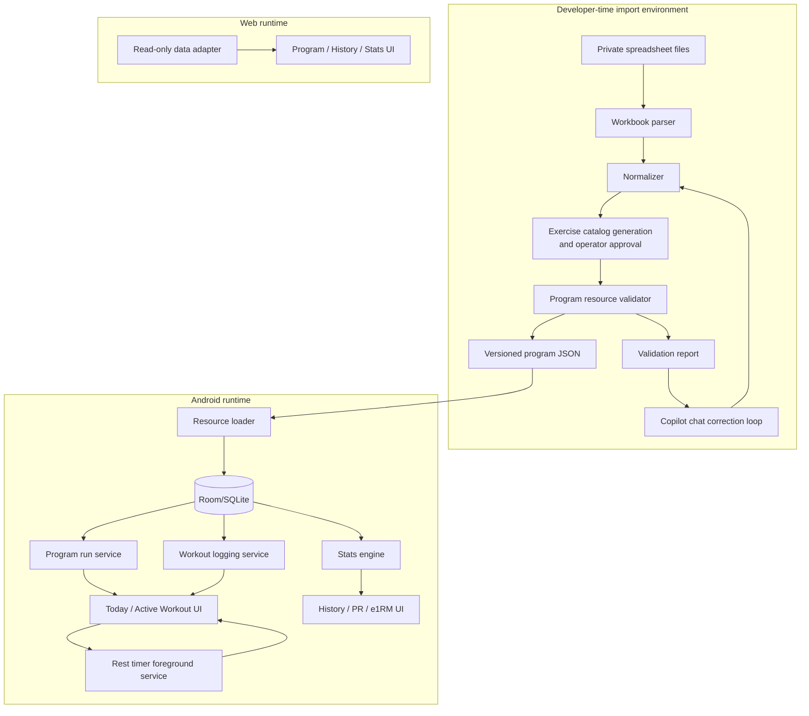

## Android architecture

### Android layers

| Layer | Responsibility | Must not do |
| --- | --- | --- |
| Compose UI | Render screens, collect user input, expose large touch targets | Own durable workout state |
| View models | Translate user actions into domain commands, expose observable UI state | Bypass repositories or write directly to DB |
| Domain services | Enforce scheduling, prescription, logging, substitution, progression, timer, and stats rules | Depend on Android UI APIs |
| Repositories | Provide transactional persistence and query APIs | Hide failed writes or return success-shaped fallbacks |
| Room database | Store local source of truth and sync-ready metadata | Store only derived state when raw event/log data is required |
| Platform services | Foreground timer notifications, permissions, process lifecycle hooks | Block workout logging when timer permission is denied |

### Android module map

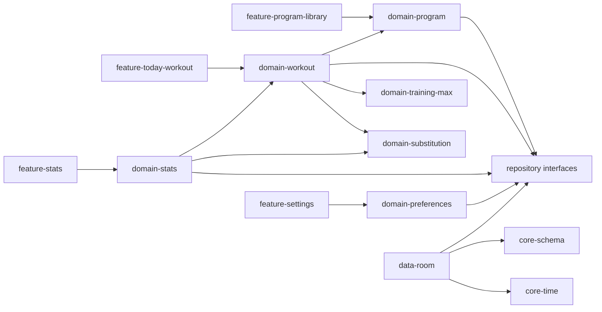

The actual Gradle modules can be coarser at first, but code boundaries should follow this structure.

Dependency inversion rule: domain modules own repository interfaces; `data-room` implements them; app-level dependency injection wires implementations to interfaces. Domain code must not import Room entities, DAOs, Android `Context`, or platform services directly.

### Android primary services

#### ProgramResourceLoader

Input: finalized versioned JSON resource.

Responsibilities:

- Validate schema version.
- Validate activation status.
- Insert or update immutable `Program` and `ProgramVersion` records.
- Preserve import audit and validation issues.
- Reject unsupported or critical resources.

Idempotency/conflict rules:

- Same program version ID and same content hash: no-op.
- Same program version ID and different content hash: reject as version conflict.
- Same program ID and new version ID: insert new immutable version.
- Active/completed runs remain pinned to their original version.
- Partial load failure must roll back the full import transaction.

#### ProgramRunService

Responsibilities:

- Start program run from a pinned program version. *(android-program-runner: shipped — `StartProgramRun`.)*
- Enforce one active program run. *(android-program-runner: shipped — DB unique index on `program_run.activeRunSlot`; see `docs/decisions.md` 2026-05-17 "One active program run enforced by DB unique index on activeRunSlot".)*
- Generate planned session occurrences. *(android-program-runner: shipped — `seedScheduleOccurrences` writes the variant-aware occurrence rows in the same Room transaction as the run row.)*
- Reschedule missed sessions. *(android-program-runner follow-on slice; not implemented in Phase 4.)*
- Repeat workouts/weeks. *(android-program-runner: `RepeatProgramRun` shipped; week-level repeat-without-progression is workout-logging scope.)*
- Pause, abandon, complete, restart, and repeat program runs. *(android-program-runner: `AbandonProgramRun` and `RepeatProgramRun` shipped; `CompleteProgramRun`, `PauseProgramRun`, and `RestartProgramRun` are MVP requirements deferred to a follow-on `android-program-runner` slice — the `ProgramRunStatus` enum currently models only `Active | Completed | Abandoned`. Pause requires adding a `Paused` enum value plus a Room migration when introduced.)*
- Preserve planned schedule separately from actual completion history. *(android-program-runner: shipped — `ScheduleOccurrenceEntity` is distinct from any future `WorkoutSession` row.)*

#### WorkoutLoggingService

Responsibilities:

- Start workout session from planned or allowed unscheduled active-program session.
- Persist each user-visible mutation in a Room transaction.
- Log prescribed, actual, skipped, extra, and note values.
- Preserve calculation snapshots.
- Apply substitutions and undo according to contract.
- Recover open sessions after process death.

#### TrainingMaxService

Responsibilities:

- Collect required max/reference values.
- Resolve effective-dated maxes.
- Calculate percent loads with program rounding rules.
- Snapshot calculated targets at workout time.
- Update future prescriptions without rewriting history.
- Execute supported progression rules.

#### SubstitutionService

Responsibilities:

- Provide approved alternatives.
- Capture substitution reason and scope.
- Preserve original and performed exercise IDs.
- Apply "always for this exercise future runs" scope.
- Undo substitutions.
- Feed history/adherence/stats with prescribed-versus-performed data.

#### StatsService

Responsibilities:

- Build exercise history from raw logs.
- Compute PRs.
- Compute Epley and Brzycki e1RM trends for squat, bench press, deadlift, and overhead press.
- Apply stats inclusion/exclusion rules.
- Preserve source-set drilldowns.
- Rebuild or invalidate caches after edits/deletes.

#### RestTimerService

Responsibilities:

- Enforce global and per-workout timer preferences.
- Start, pause, skip, and adjust timers.
- Use Android foreground-service/notification behavior for locked-phone alerts.
- Block timer start when notification permission prevents alerts.
- Never block workout logging because timer permission is denied.

## Local data architecture

Room/SQLite is the local source of truth. The schema must preserve raw facts first and derive stats second.

### Domain entity relationship

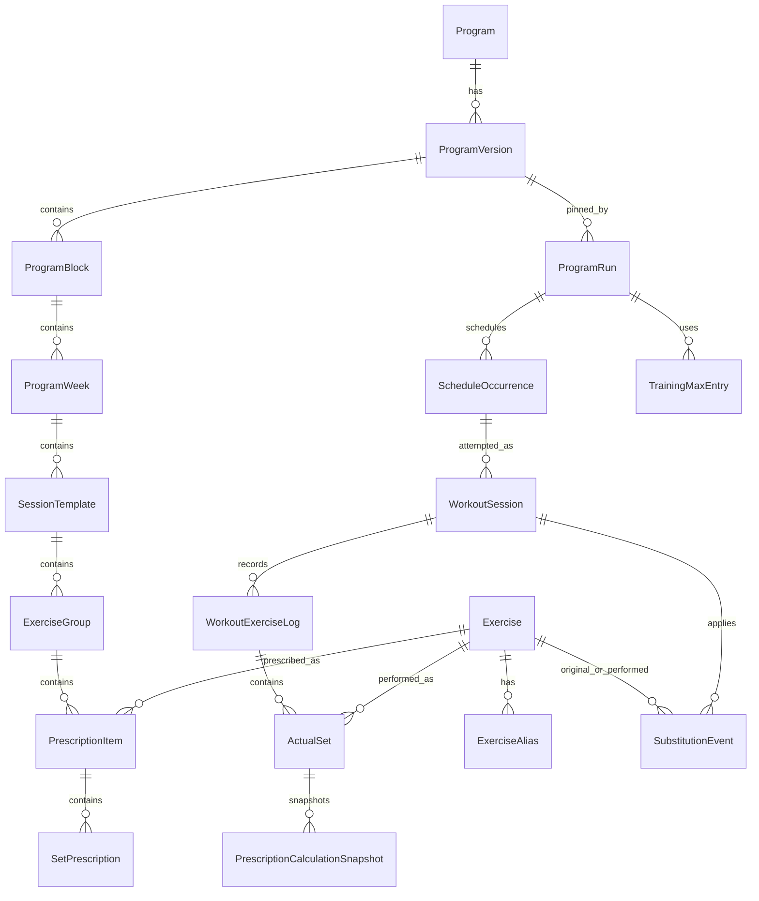

### Core persistence rules

- Program definitions are immutable after activation.
- Program run state is mutable but fully audited through sync-ready metadata.
- Planned schedule occurrences are not the same as actual workout sessions.
- Actual sets can link to prescribed sets or exist as extra sets.
- Substitutions are first-class records; do not overwrite prescribed exercise IDs.
- Training max entries are effective-dated.
- Calculation snapshots preserve the values used at workout time.
- Stats cache is disposable; raw logs are authoritative.

### Minimum entity invariants

These fields are the minimum architecture-level invariants. Final schema fields can expand, but implementations must not omit these concepts.

#### WorkoutSession

- Stable ID.
- Program run ID.
- Planned session occurrence ID when started from schedule.
- Program version ID snapshot.
- Status: planned, in_progress, completed, abandoned.
- Started instant, event zone, local date.
- Completed/abandoned instant when applicable.
- Last visible saved mutation ID.
- Sync-ready metadata.

#### WorkoutExerciseLog

- Stable ID.
- Workout session ID.
- Prescribed exercise ID.
- Current performed exercise ID.
- Exercise group/prescription item reference.
- Display order.
- Completion/skipped state.
- Notes.
- Sync-ready metadata.

#### ActualSet

- Stable ID.
- Workout exercise log ID.
- Optional prescribed set ID.
- Set role: warmup, working, top, backoff, AMRAP, optional, extra.
- Prescribed values snapshot or reference.
- Actual load, reps, RPE/RIR, notes.
- State: pending, completed, skipped.
- Per-side flag when applicable.
- Performed exercise ID.
- Source substitution event ID when applicable.
- Sync-ready metadata.

#### PrescriptionCalculationSnapshot

- Stable ID.
- Actual set ID.
- Reference type.
- Reference exercise/lift ID.
- Reference value and unit.
- Percent or formula used.
- Rounding rule used.
- Calculated raw load.
- Display load.
- Caveats.

#### TrainingMaxEntry

- Stable ID.
- Program run ID.
- Exercise/lift ID.
- Reference type.
- Value and unit.
- Effective instant, event zone, local date.
- Source: setup, user update, progression, import requirement.
- Superseded entry ID when applicable.
- Sync-ready metadata.

#### SubstitutionEvent

- Stable ID.
- Program run ID.
- Workout session ID when first applied.
- Original prescribed exercise ID.
- Performed substitute exercise ID.
- Reason.
- Scope.
- Active/undone state.
- Undo mutation ID when applicable.
- Stats inclusion policy.
- Sync-ready metadata.

#### LocalMutation

- Stable client mutation ID.
- Entity type and entity ID.
- Mutation type.
- Created instant, event zone, local date.
- Device ID.
- Local revision before/after.
- Tombstone flag when applicable.

#### RestTimerState

- Stable ID.
- Workout session ID.
- Status: disabled, eligible, blocked_permission, running, paused, elapsed, dismissed.
- Started instant.
- Duration.
- Remaining duration when paused.
- Notification permission state at start.
- Last foreground-service notification ID when applicable.
- Sync-ready metadata only if persisted as user-visible workout state.

### Sync-ready metadata

Every sync-relevant entity listed in the MVP implementation contracts must support:

- Stable client-generated identity.
- Created/updated/deleted timestamps.
- Device ID.
- Local revision.
- Client mutation ID for user-visible mutations.

This metadata is required even though cloud sync is not implemented in MVP.

#### Sync-readiness rollout status

The sync-metadata field set rolls out per entity by the workstream that introduces the entity. Adding the missing fields later requires a Room migration owned by the same workstream. Phase 4 (`android-program-runner`) deliberately introduced only `updatedAtEpochMillis` on `program_run` and `schedule_occurrence` to unblock the v1→v2 migration test without inventing field semantics that the future sync design will own. Each workstream that adds or modifies a sync-relevant entity MUST add an entry to this table and update it as fields land:

| Entity (Room) | Workstream | Stable client ID | createdAt | updatedAt | deletedAt | deviceId | localRevision | clientMutationId |
| --- | --- | --- | --- | --- | --- | --- | --- | --- |
| `loaded_program_version` | `android-program-runner` | ✓ (`programVersionId`) | `loadedAtEpochMillis` | — | — | — | — | — |
| `program_run` | `android-program-runner` | ✓ (`programRunId`) | `startedAtEpochMillis` | ✓ (v2) | — | — | — | — |
| `schedule_occurrence` | `android-program-runner` | ✓ (`occurrenceId`) | — (carried by parent `program_run.startedAtEpochMillis`) | ✓ (v2) | — | — | — | — |
| `program_run_reference_value` | `android-program-runner` | ✓ (composite `programRunId + referenceId`) | `suppliedAtEpochMillis` | — | — | — | — | — |
| `workout_session` / `workout_exercise_log` / `actual_set` / `prescription_calculation_snapshot` / `local_mutation` | `android-workout-logging` | planned | planned | planned | planned | planned | planned | planned |
| `training_max_entry` | `android-training-max-progression` | planned | planned | planned | planned | planned | planned | planned |
| `substitution_event` | `android-catalog-substitutions` | planned | planned | planned | planned | planned | planned | planned |
| `stats_cache` | `android-stats-history` | planned | planned | planned | n/a (cache; see Stats architecture) | planned | planned | n/a (derived) |

Gaps marked `—` are accepted MVP gaps that the listed owning workstream must close before its acceptance. New entities introduced outside this table without a sync-metadata plan MUST be rejected in review.

## Program resource architecture

Versioned JSON is the contract between import and app runtime.

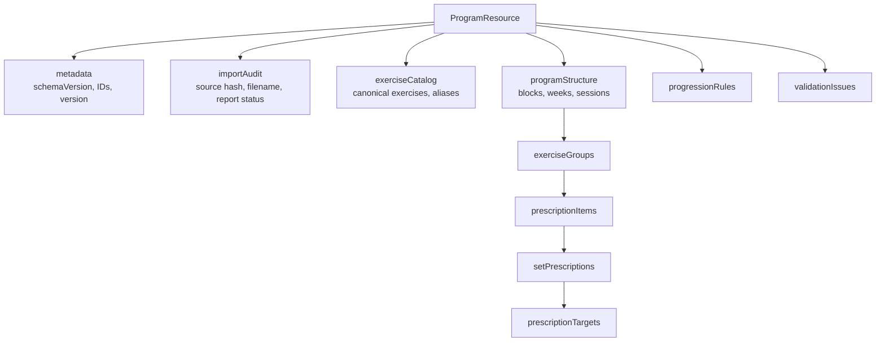

### Resource activation

A resource is activatable only when:

- Schema version is supported.
- Program/version IDs are stable.
- No critical validation issues remain.
- Every exercise maps to an approved canonical exercise or alias.
- Required first-week max/reference values are declared.
- Schedule ordering is unambiguous.
- Unsupported constructs are absent or classified as note-only.

### Week variants (runtime alternates)

Some programs include weeks where the user chooses ONE of multiple templates and runs only that template before moving to the next sequential week (e.g. a PR test week vs a volume week occupying the same logical slot). The schema models this with two optional fields on `programWeek`:

- `variantOf` — id of another `programWeek` in the SAME block. The week declaring `variantOf` is an alternate of the base week.
- `variantLabel` — operator-facing label distinguishing this variant within its group (e.g. "A", "B"). Required on every member of a multi-member group; labels must be unique within the group.

Semantic rules: variant groups must be contiguous in the block's `weeks[]` array; chain depth is bounded to 1 (no variant of a variant); reference validation uses the BASE week's `weekIndex` when a required reference is consumed only inside a variant. Resources that use `variantOf` MUST declare `schemaVersion >= 2`. Variant-unaware loaders MUST reject `schemaVersion >= 2` rather than silently running every week of a variant group sequentially. android-program-runner `ProgramResourceLoader` owns the runtime presentation of the variant choice and the recording of which variant the user picked, so progression and stats only count the executed variant. See `docs/decisions.md` 2026-05-17 *programWeek runtime variants*.

### Duplicate and partial import handling

- Resource load occurs in one transaction.
- If any program structure, catalog, validation issue, or audit record fails to persist, the whole load rolls back.
- Duplicate resource loads follow the idempotency/conflict rules in `ProgramResourceLoader`. The `(programVersionId, contentHash)` invariant is also enforced at the DB layer by a `UNIQUE INDEX` on `loaded_program_version.contentHash` from `LiftoriumDatabase` v2 onward (see `docs/decisions.md` 2026-05-17 "LiftoriumDatabase v1→v2 audit columns and composite occurrence index"). Concurrent racy loads that bypass the in-code check still fail with a typed constraint error, never with silent data corruption.
- Validation reports are retained for rejected resources, but rejected resources cannot be activated.

### Resource migration

When schema versions evolve:

- Add explicit resource migration functions.
- Do not mutate historical program versions.
- Re-import source material to create a new program version.
- Preserve completed history against the old program version.

## Import workflow architecture

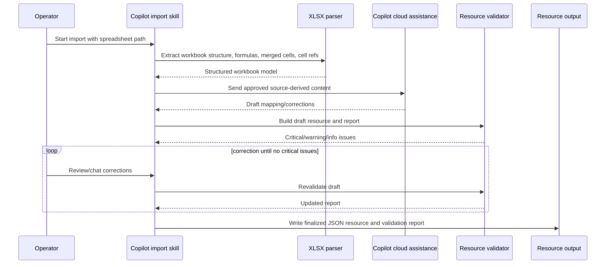

### Import components

| Component | Responsibility |
| --- | --- |
| Workbook parser | Read sheets, cells, formulas, merged regions, dimensions, and references |
| Structure detector | Identify program title, weeks, days, sessions, rest days, exercises, and prescriptions |
| Exercise mapper | Generate canonical exercise candidates and aliases for operator approval |
| Prescription normalizer | Convert spreadsheet patterns into structured prescriptions or note-only instructions |
| Progression normalizer | Convert supported progression rules into executable rules |
| Validator | Assign critical/warning/info issues and activation status |
| Correction loop | Let operator and Copilot update resource/report before finalization |

### Import privacy

- Original source files are private.
- The developer running the import-workflow skill is the cloud-assisted processor; no separate consent prompt is shown.
- Store filename, hash, import date, sheet names, and cell references where needed.
- Avoid storing proprietary excerpts unless strictly necessary and explicitly approved.
- Do not commit source spreadsheets or PDFs by default.

## Workout execution flow

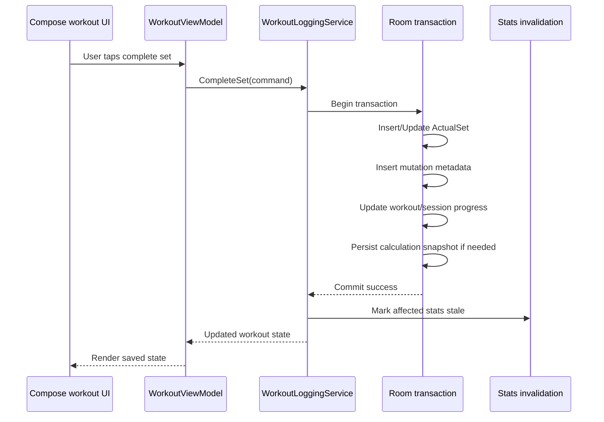

### Recovery flow

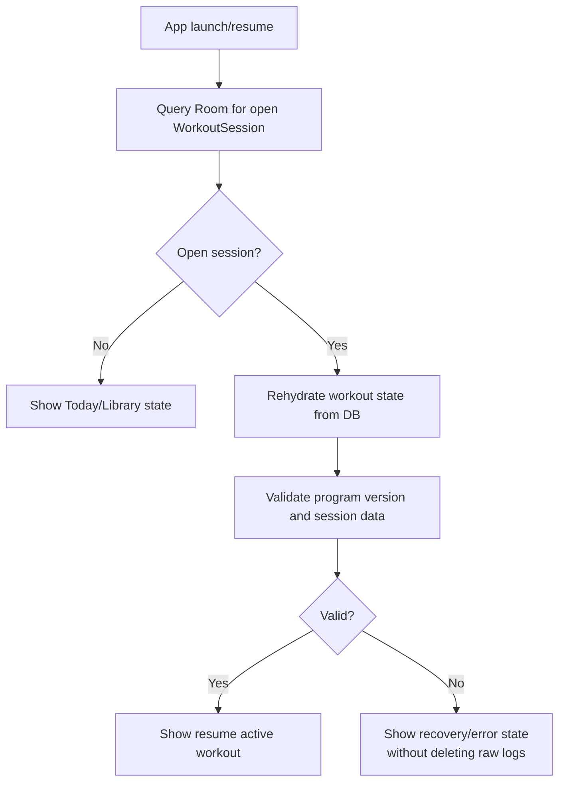

### Transactional mutation boundary

Each user-visible workout mutation must be a transaction:

- Start workout.
- Complete set.
- Edit set.
- Skip set or exercise.
- Add set.
- Add/update note.
- Log RPE/RIR.
- Apply/undo substitution.
- Update training max/reference.
- Complete or abandon workout.
- Reschedule session.
- Repeat workout/week.
- Pause, abandon, complete, or restart program run.
- Start, stop, or adjust rest timer state.

Adding a new mutation requires updating the MVP implementation contracts and adding a transactional persistence test.

## Scheduling architecture

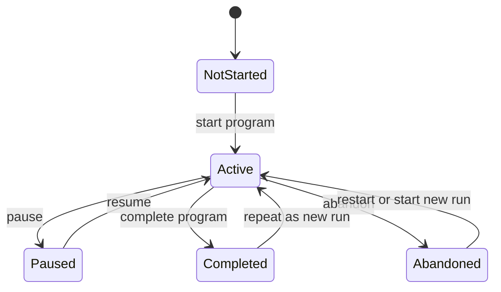

This diagram describes the MVP target. Current Phase 4 implementation covers the `Active`, `Completed`, and `Abandoned` states only; `NotStarted` is implicit (no `ProgramRunEntity` row exists yet) and `Paused` is deferred to a follow-on `android-program-runner` slice (see `ProgramRunService` responsibilities above). Adding `Paused` requires a `Paused` value on `ProgramRunStatus`, a Room migration, and a typed `PauseProgramRun` use case.

Planned schedule and actual history are separate:

- `ScheduleOccurrence`: intended order/date/status (the `android-program-runner` implementation name; the v1 architecture draft used `PlannedSessionOccurrence` as a synonym).
- `WorkoutSession`: actual attempt, start time, completion time, and outcome.
- Repeating a workout creates a separate actual attempt.
- Repeating a program creates a new program run.
- Rescheduling changes planned occurrences without rewriting completed history.

## Training max and progression architecture

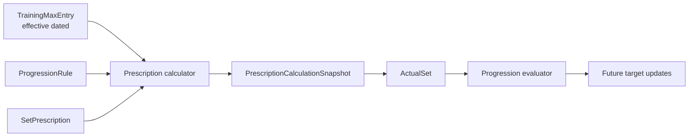

Rules:

- Max/reference updates are effective-dated.
- Completed workouts retain calculation snapshots.
- Supported progression rules can update future targets.
- Unsupported progression blocks activation unless later classified.
- User overrides are stored as actual values and do not mutate prescribed history.

## Substitution architecture

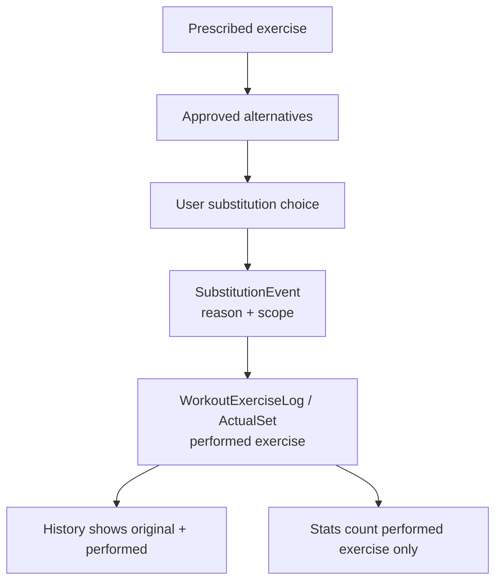

Substitution scope in MVP:

- Always for this exercise in future runs.
- Undo is supported.

Stats behavior:

- Performed work counts toward performed exercise stats only.
- Original prescribed exercise remains visible for adherence and prescribed-versus-performed history.

## Timer architecture

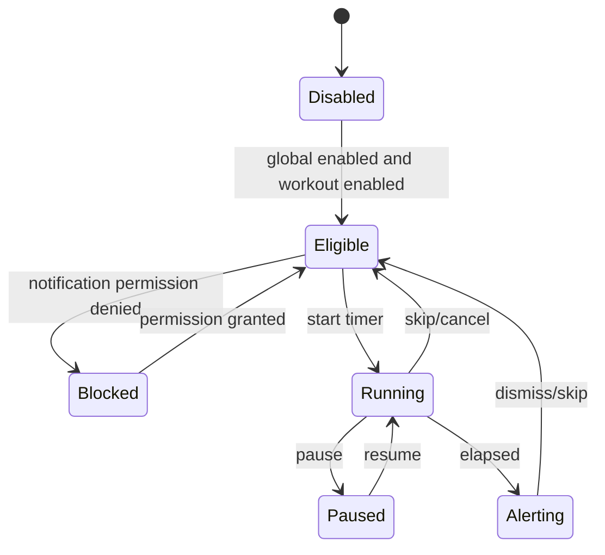

Timer rules:

- Timer behavior is separate from workout logging.
- Notification permission denial blocks timer start, not workout logging.
- Android implementation uses a foreground service with an ongoing notification while a rest timer is running.
- Planned manifest/runtime permissions:
  - `POST_NOTIFICATIONS` runtime permission for visible timer notifications.
  - `FOREGROUND_SERVICE`.
  - `FOREGROUND_SERVICE_SPECIAL_USE` with a documented subtype such as `workout_rest_timer`, unless implementation research during Android setup confirms `FOREGROUND_SERVICE_HEALTH` is both valid and preferable for Play policy.
- Timer does not require `SCHEDULE_EXACT_ALARM` in MVP because the foreground service owns countdown timing while active. If implementation later uses exact alarms, that decision must update `docs/decisions.md`, this architecture, and timer tests.
- Timer state is persisted so app recreation can display accurate state, but the foreground service notification is the user-visible locked-phone alert mechanism.
- Runtime tests must cover timer disabled, permission denied, locked-phone alert, foreground-service restart/rebind, and documented Doze/OEM limitations.
- Web has no locked/background timer guarantee in MVP.

## Stats architecture

Stats are derived from raw workout logs and calculation snapshots.

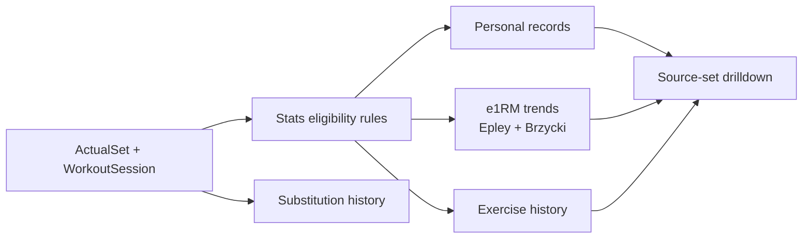

Derived stats can be cached, but the cache is not authoritative. Any edit/delete to raw logs must invalidate or rebuild affected stats.

## Web architecture

Web MVP is intentionally constrained to avoid creating a sync problem before sync exists.

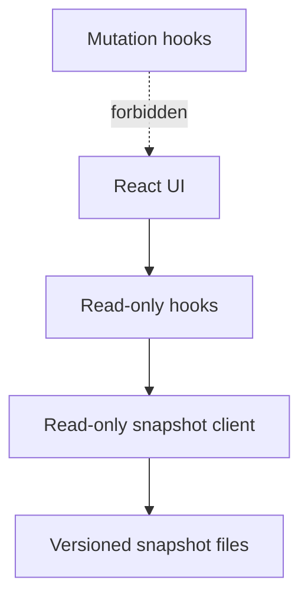

Rules:

- No workout logging.
- No training max edits.
- No substitution edits.
- No program-run mutations.
- No offline workout persistence.
- No locked/background timer promise.
- No implied access to live Android local data.
- Snapshot freshness must be visible when rendering history/stats snapshots.

Tests must fail if Web introduces non-read APIs for MVP-protected domains.

## MVP implementation contracts

These contracts are part of the architecture. Implementation work must update this section when behavior changes; do not create separate phase-contract documents.

### Program Construct Matrix

| Construct | MVP classification | Notes |
| --- | --- | --- |
| Exact sets/reps/load | Structured | Executable prescription. |
| Rep ranges | Structured | Actual reps logged within/outside range. |
| Percent/training-max loads | Structured | Requires reference type, lift/exercise, value, unit, and rounding rule. |
| RPE/RIR targets | Structured | Supports target, range, cap, actual value, and target-met status. |
| Prescribed warmups | Structured | Excluded from PR/e1RM by default. |
| User-added warmups | Structured | Excluded from PR/e1RM by default. |
| AMRAP sets | Structured | Eligible for PR/e1RM when actual load and reps exist. |
| Optional work | Structured | User can complete or skip; stats inclusion follows set classification. |
| Supersets/circuits/paired work | Structured | Preserve grouping and order. |
| Top sets | Structured | Preserve role for display, history, and progression. |
| Back-off sets | Structured | Preserve role and relationship to top set where available. |
| Supported progression rules | Structured | Full automation for supported programs. |
| Tempo | Note-only | Visible instruction; not automated in MVP. |
| Rest-pause/myo-reps | Note-only | Visible instruction; not automated in MVP. |
| Drop sets | Critical | Blocks activation in MVP. Hypertrophy programs requiring drop sets are outside MVP import scope unless a later decision classifies them. |
| Density/EMOM/for-time work | Critical | Blocks activation in MVP. |
| Complex unsupported autoregulation | Critical | Blocks activation unless expressed as supported progression or note-only by a later decision. |
| PDF/manual-only context | Out of MVP import scope | Spreadsheet-only MVP; may be manually represented in approved notes if provided during review. |
| Unknown exercise | Critical until approved | Requires generated catalog entry or alias approval. |
| Missing required max/reference | Critical or workout-start block | Missing references needed in the first runnable week block activation. Missing references needed only for later weeks can activate but must block affected workout start until supplied. |
| Ambiguous week/day ordering | Critical | Program cannot activate until ordered. |

Any construct not listed here is critical by default until the decisions log and this matrix classify it.

Reclassification rule: changing a construct classification requires a decisions-log entry. Existing imported resources are not mutated; re-import creates a new program version with the updated classification.

### Validation severity contract

| Condition | Severity | Activation behavior |
| --- | --- | --- |
| Ambiguous week/day/session ordering | Critical | Block activation. |
| Unknown exercise without approved mapping | Critical | Block activation. |
| Unsupported construct classified as critical | Critical | Block activation. |
| Missing required max/reference in first runnable week | Critical | Block activation. |
| Missing required max/reference for later week | Warning until affected workout | Activation allowed; affected workout start blocks until supplied. |
| Tempo instruction | Warning | Activation allowed as visible note. |
| Rest-pause/myo-rep instruction | Warning | Activation allowed as visible note. |
| Source filename/hash missing | Warning | Activation allowed only for synthetic fixtures; private imports should include provenance. |
| Informational source cell reference | Info | No activation impact. |

Any new validation condition must be added to this table before implementation.

### Prescription and stats rules

#### Rounding

- Default unit is pounds.
- Barbell percentage loads round to nearest 2.5 lb by default.
- Program resources can override rounding per program, block, exercise, or prescription.
- Non-barbell calculated loads are displayed exactly and entered manually in MVP.
- Rounding tests must cover exact midpoint behavior, below-minimum loads, and program override precedence.

#### RPE/RIR target matching

- Exact RPE/RIR target is met only when actual value equals target.
- RPE/RIR range is met when actual value is inside the inclusive range.
- RPE cap is met when actual RPE is less than or equal to the cap.
- RIR floor is met when actual RIR is greater than or equal to the floor.
- Missing actual RPE/RIR means target-met status is unknown, not failed.

#### PR definitions

MVP PR types:

- Heaviest load for an eligible exercise/set.
- Best estimated 1RM.
- Best reps at a given load.

PRs must store source set ID, performed exercise ID, program run ID, workout session ID, formula where applicable, timestamp, and local date.

#### e1RM rules

- MVP formulas: Epley and Brzycki.
- e1RM input requires actual load greater than 0 and reps greater than 0.
- Skipped sets, warmups, and note-only prescriptions are excluded.
- Substituted sets count only toward the performed exercise.
- RPE/RIR values are metadata and caveats; they do not by themselves make a set eligible or ineligible.
- Sets over 10 reps can be calculated but must carry a high-rep caveat.
- e1RM output preserves formula name, raw value, rounded display value, source set ID, and caveats.

#### Stats inclusion

| Record type | History/adherence | PR/e1RM |
| --- | --- | --- |
| Working set | Include | Include if load/reps eligible. |
| AMRAP set | Include | Include if load/reps eligible. |
| Warmup/ramping set | Include | Exclude by default. |
| Optional work completed | Include | Include only if classified as working/AMRAP and load/reps eligible. |
| Optional work skipped | Include as skipped | Exclude. |
| Skipped set/exercise | Include as skipped | Exclude. |
| Substituted set | Include original and performed history | Count only toward performed exercise PR/e1RM. |
| RPE/RIR-based set | Include | Include if actual load/reps eligible; RPE/RIR stored as caveat metadata. |

#### Substitution stats policy

- Preserve original prescribed exercise ID.
- Preserve performed exercise ID.
- Preserve substitution reason and scope.
- Count performed work toward performed exercise stats only.
- Show original exercise in adherence and prescribed-versus-performed history.

#### Exercise recognition across re-import

Recognition precedence:

1. Existing canonical exercise ID in the resource.
2. Approved alias match.
3. Operator approval of generated candidate.

Unrecognized exercises are critical until approved.

### Sync-readiness contract

MVP has no cloud sync, but persistent user-created and app-created records must be sync-ready.

Required metadata for sync-relevant entities:

- Stable client-generated ID.
- `createdAt`.
- `updatedAt`.
- Nullable `deletedAt` for tombstones where deletion/edit history matters.
- `deviceId`.
- `localRevision`.
- `clientMutationId` for user-visible mutations.

Sync-relevant entities:

- `Exercise`
- `ExerciseAlias`
- `ExerciseFamily`
- `Equipment`
- `Program`
- `ProgramVersion`
- `ProgramImportAudit`
- `ProgramValidationIssue`
- `ProgramBlock`
- `ProgramWeek`
- `SessionTemplate`
- `ExerciseGroup`
- `PrescriptionItem`
- `SetPrescription`
- `PrescriptionTarget`
- `ProgramRun`
- `ScheduleOccurrence` (planned session occurrence; implementation entity is `ScheduleOccurrenceEntity`)
- `ProgramRunReferenceValue` (run-scoped runtime injection of training-max / 1RM references)
- `WorkoutSession`
- `WorkoutExerciseLog`
- `ActualSet`
- `SubstitutionEvent`
- `TrainingMaxEntry`
- `PrescriptionCalculationSnapshot`
- `UserPreference`
- `LocalMutation`
- `StatsCache`

Identity rules:

- Do not use autoincrement database IDs as public identity.
- Program resource versions are immutable and have stable version IDs.
- Program runs pin one program version.
- Actual workout attempts have identities distinct from planned schedule occurrences.
- Exercise canonical IDs must survive re-import according to the recognition precedence above.

Clock rules:

- Store an instant for ordering.
- Store event time zone.
- Store denormalized local date for schedule/history queries.
- Local date is computed from the device time zone at save time and is never recomputed after travel or daylight-saving changes.

Tombstone rules:

- User-visible undo is session-only.
- Durable internal edit audit is retained for workout logs, substitutions, training max changes, and entities needed for future restore/sync.

### JSON resource versioning contract

Every app-ready program resource must include:

- `schemaVersion`.
- Stable program ID.
- Stable program version ID.
- Version/revision label.
- Import audit metadata.
- Validation status.
- Validation issues.

Rules:

- The app validates JSON before activation.
- Unsupported `schemaVersion` fails validation.
- Schema migrations are implemented as explicit migration functions.
- Re-importing creates a new immutable program version.
- Historical program versions are never mutated to match new imports.
- Completed history remains tied to the exact program version used.

### Room migration contract

From the first schema:

- Export Room schema snapshots.
- Provide migration tests.
- Preserve raw workout logs, program version links, calculation snapshots, substitutions, training max history, tombstones, and sync-ready metadata.
- Derived stats may be rebuilt or invalidated during migration, but raw logs must not be lost.

Current status: `LiftoriumDatabase` is at version 2. Both `1.json` and `2.json` are committed under `android/data/schemas/dev.liftorium.data.LiftoriumDatabase/`. `Migration1To2` is additive (audit columns + composite occurrence index + `contentHash` unique index) and covered by `MigrationTest`. Future migrations append a `MigrationN_to_M` to `LIFTORIUM_DATABASE_MIGRATIONS` and ship an `N.json` snapshot; destructive `fallbackToDestructiveMigration` is not permitted.

### Durability contract

Workout data trust is a core product requirement.

Rules:

- Active workout session state is stored in Room.
- Every user-visible logging action writes through a Room transaction.
- Logging actions include complete set, edit set, skip set/exercise, add set, note update, RPE/RIR update, substitution, undo, and training max/reference update.
- The logging action list is exhaustive for MVP. Adding a user-visible mutation requires updating this contract and adding a transactional persistence test.
- MVP user-visible mutations also include start workout, complete workout, abandon workout, reschedule session, repeat workout/week, pause/abandon/complete program run, and start/stop/adjust rest timer state.
- Recovery reads open sessions from Room.
- In-memory state is a cache of persisted state, not the source of truth.
- Process death after a visible save must recover the last visible saved state.
- Session-visible undo does not have to survive process death. The durable edit audit must survive process death.

### Timer contract

Android:

- Locked-phone rest timer alerts are required.
- Use Android foreground-service/notification behavior appropriate for API 34+.
- Notification permission is required for timer alerts.
- If notification permission is denied, timer start is blocked with a clear explanation.
- Workout logging remains usable when timer permission is denied.
- Global timer disable prevents auto-start.
- Per-workout timer disable prevents auto-start for that workout.
- Timer implementation must document selected foreground service type and permissions before Android implementation.
- Doze, OEM battery restrictions, exact alarm permission behavior, and notification denial flows must have explicit runtime test cases or documented platform limitations.

Web:

- No locked/background timer guarantee in MVP.
- Web is not used for workout logging in MVP.

### Web read-only guard contract

Web MVP must enforce read-only scope mechanically:

- The Web API client exposes read operations only.
- Web tests fail if non-GET mutation methods are introduced for workout sessions, substitutions, training maxes, program runs, or timer state.
- Components may import read-only hooks only.
- Web copy must not claim offline workout logging or locked/background timer support.

### Import privacy contract

The import workflow is invoked by a developer in a Copilot session against a workbook they tagged. That action is the operator's intent; no separate consent prompt is shown.

Stored provenance may include:

- Source filename.
- Source hash.
- Import date/time.
- Sheet names.
- Cell references.
- Validation issues.

Stored provenance must avoid unnecessary proprietary excerpts.

## Error and failure handling

| Failure | Required behavior |
| --- | --- |
| Save failure | Surface error; do not show success state for unsaved action. |
| Low storage | Block unsafe actions or warn before data loss risk; preserve existing logs. |
| App killed mid-workout | Recover from Room to last visible saved state. |
| Corrupted resource | Block activation; preserve report and diagnostic. |
| Missing max/reference | Block activation or affected workout start according to contract. |
| Unknown exercise | Block activation until operator approval. |
| Unsupported construct | Block activation unless classified as note-only. |
| Notification denied | Block timer start; keep workout logging usable. |
| Stats cache stale | Rebuild or invalidate from raw logs. |

## Test architecture

Architecture is only accepted when tests prove the contracts:

- Unit tests for deterministic domain rules.
- Integration tests for resource loading, repositories, scheduling, substitutions, max updates, and stats rebuild.
- Room migration tests from the first schema.
- Android runtime/E2E tests for offline workout, process death recovery, timer permission, substitutions, repeats, and rescheduling.
- Web tests for read-only scope.
- Import validation tests for synthetic and approved private spreadsheet-derived fixtures.
- Architecture fitness functions enforce module boundaries in CI (see `docs/decisions.md` 2026-05-24):
  - `verifyModuleGraph` (Gradle): asserts only ADR-approved inter-module `ProjectDependency` edges exist across all Android variant configurations.
  - ArchUnit on `:domain` and `:data`: domain external-dependency allowlist, no Android dispatchers in domain, domain slice-cycle freedom, repository-interface invariant, `domain.common` dependency-leaf rule; `:data` UI/lifecycle ban, no `:app` dep, Room `@Entity`/`@Dao` locality, data slice-cycle freedom.
  - `verifyAppUiBoundary` (Gradle source scan): asserts `app/src/<any-production-sourceSet>/.../dev/liftorium/app/ui/**` does not reference `dev.liftorium.data..`. Replaces ArchUnit on `:app` (AGP's ASM transform is incompatible with `archunit-junit4`).
  - `verifyRoomLocality` (Gradle source scan): asserts `androidx.room` annotations only appear in `:data`.
  - All four tasks are wired into every module's `check` lifecycle and use `.because(...)` clauses citing this document and `docs/decisions.md`.

Traceability from acceptance scenario to contract and planned test ID is maintained in `docs/product.md`.

## Future Azure sync boundary

MVP does not implement sync, but it must not block future sync:

- Use stable client-generated IDs.
- Preserve tombstones and mutation metadata where specified.
- Keep local raw logs authoritative.
- Avoid Web mutations until cloud sync exists.
- Keep program versions immutable and content-versioned.

Future sync can be added behind repository interfaces without changing core domain rules, but conflict behavior must be separately designed before implementation.
